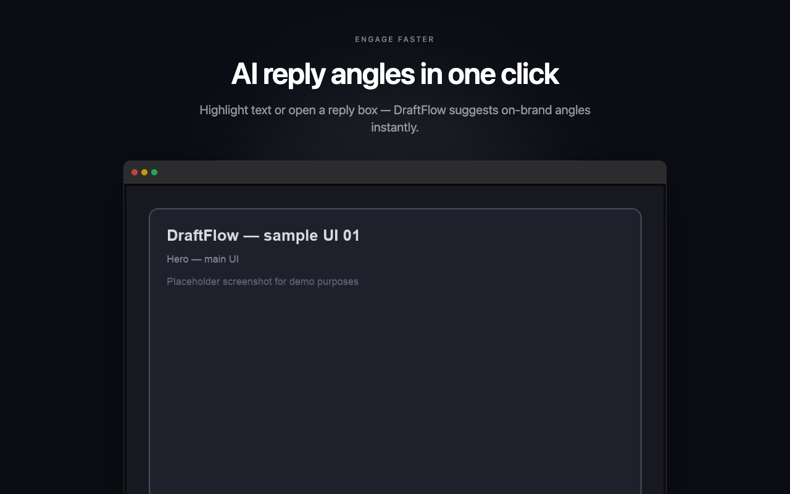
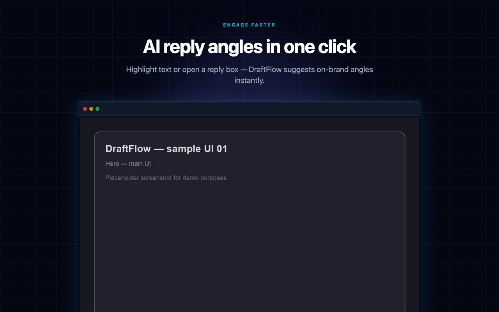
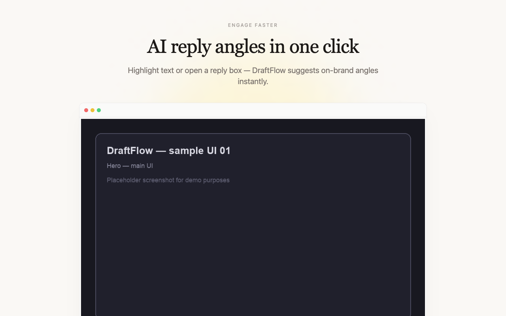
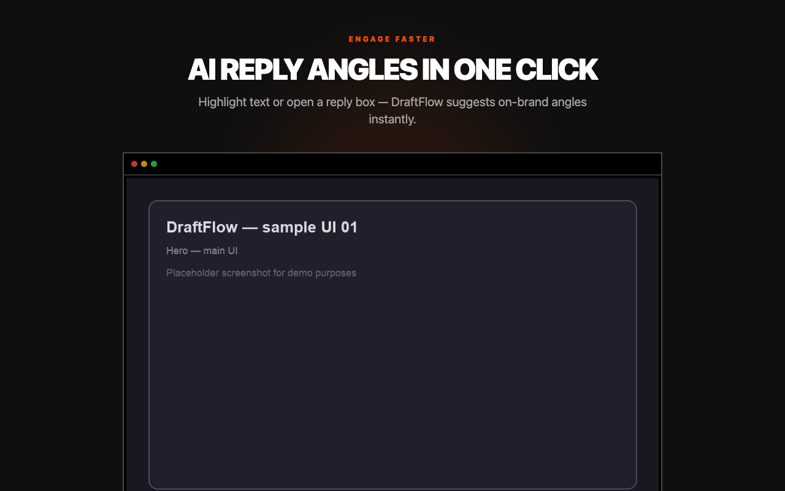
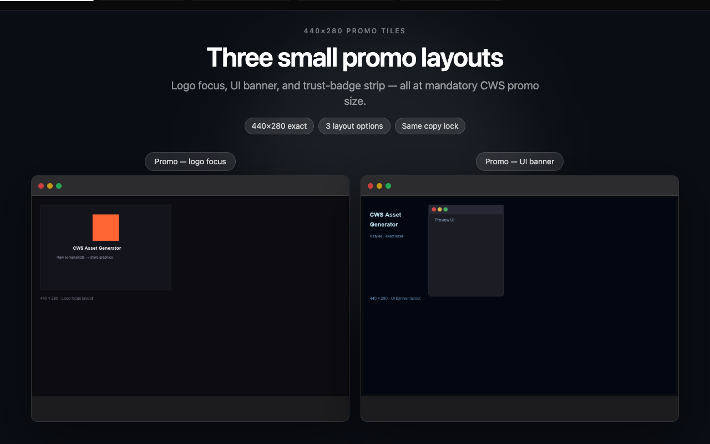
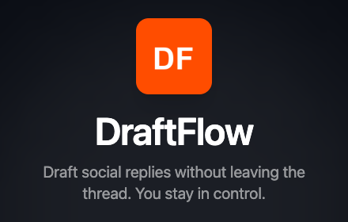
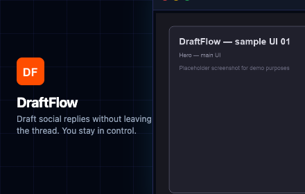
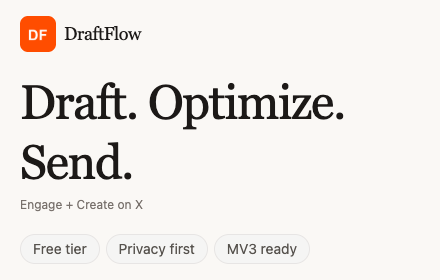

# Chrome Web Store Asset Generator

**Turn raw extension screenshots into Chrome Web Store listing graphics — with copy you approve first.**

An [Agent Skill](https://agentskills.io) for Cursor, Claude Code, Codex, GitHub Copilot, and 70+ other AI coding agents. Guides your agent through a gated workflow: product context → asset mapping → copy variants → slide-by-slide sign-off → **4 visual style packages** + promo tiles → local preview + PNG export.

> **No AI image generation.** Your real product screenshots go into React layout templates. The agent handles copy, composition, and export at exact CWS dimensions (1280×800 screenshots, 440×280 promo tiles).

---

## Why this skill exists

Chrome Web Store listings need polished screenshots and promo tiles. Doing it in a design tool for every extension is slow — and you often want **multiple visual directions** before picking one.

This skill teaches your agent to:

1. **Audit** whether enough product context exists in the repo
2. **Map** your raw screenshot filenames to slide roles
3. **Propose 3 copy variants per slide** before any design work
4. **Lock copy slide-by-slide** with you (no design until you approve)
5. **Build** a local React preview with 4 style packages
6. **Export** PNGs ready for the Chrome Web Store Developer Dashboard
7. **Iterate** by slide ID (`style-b-slide-04`) or asset filename

---

## Showcase (demo output)

This demo uses **skill-focused copy** and **UI mockups of the workflow itself** (asset intake, copy gate, 4 styles, preview, export) — not a sample extension product.

| Style A — Clean Minimal | Style B — Neon Tech |
|:---:|:---:|
|  |  |

| Style C — Warm Editorial | Style D — Bold Contrast |
|:---:|:---:|
|  |  |

**Dual-image slide** (promo tile layout options):



**Promo tiles (440×280):**

| Logo focus | UI banner | Trust badges |
|:---:|:---:|:---:|
|  |  |  |

### Local preview (runnable demo)

Browse the **skill workflow demo** in your browser — same preview app the agent scaffolds for real projects.

**Requirements:** Node.js 18+, npm 9+

```bash
# 1. Clone this repo
git clone https://github.com/boteam-ai/chrome-web-store-asset-generator.git
cd chrome-web-store-asset-generator/examples/demo-preview

# 2. Install dependencies
npm install

# 3. Start dev server → open http://localhost:5173
npm run dev
```

**Optional — regenerate demo raw assets** (workflow UI mockups under `public/assets/raw/`):

```bash
python3 scripts/generate-demo-assets.py
```

**Optional — batch-export all PNGs** (writes to `export/screenshots/` and `export/promo-tiles/`):

```bash
npm run export:batch
```

| Command | What it does |
|---------|----------------|
| `npm run dev` | Tabbed preview — switch styles, export single cards |
| `npm run export:batch` | Export all 35 PNGs (32 screenshots + 3 promo tiles) |
| `npm run build && npm run preview` | Production build smoke test before sharing |

Edit demo copy in [`examples/demo-preview/src/productMeta.js`](examples/demo-preview/src/productMeta.js).  
Full install paths for agents: [INSTALL.md](INSTALL.md).

---

## Install (one command)

Replace `YOUR_USERNAME` with your GitHub username after publishing.

### Universal — 70+ agents ([skills CLI](https://github.com/vercel-labs/skills))

```bash
# User scope (recommended)
npx skills add YOUR_USERNAME/chrome-web-store-asset-generator --skill chrome-web-store-asset-generator -g -y

# Project scope
npx skills add YOUR_USERNAME/chrome-web-store-asset-generator --skill chrome-web-store-asset-generator -y
```

Target specific agents:

```bash
npx skills add YOUR_USERNAME/chrome-web-store-asset-generator \
  --skill chrome-web-store-asset-generator \
  -a cursor -a claude-code -a codex -g -y
```

### GitHub CLI ([gh skill](https://cli.github.com/manual/gh_skill_install))

Requires GitHub CLI v2.90+.

```bash
gh skill install YOUR_USERNAME/chrome-web-store-asset-generator chrome-web-store-asset-generator --agent cursor --scope user
gh skill install YOUR_USERNAME/chrome-web-store-asset-generator chrome-web-store-asset-generator --agent claude-code --scope user
gh skill install YOUR_USERNAME/chrome-web-store-asset-generator chrome-web-store-asset-generator --agent codex --scope user
```

### Codex (OpenAI)

```bash
# From Codex skill installer
python3 $CODEX_HOME/skills/.system/skill-installer/scripts/install-skill-from-github.py \
  --repo YOUR_USERNAME/chrome-web-store-asset-generator \
  --path skills/chrome-web-store-asset-generator
```

### Manual install

| Agent | User scope path |
|-------|-----------------|
| **Cursor** | `~/.cursor/skills/chrome-web-store-asset-generator/` |
| **Claude Code** | `~/.claude/skills/chrome-web-store-asset-generator/` |
| **Codex** | `~/.codex/skills/chrome-web-store-asset-generator/` |
| **Copilot / shared** | `~/.agents/skills/chrome-web-store-asset-generator/` |

```bash
git clone https://github.com/YOUR_USERNAME/chrome-web-store-asset-generator.git
ln -sf "$(pwd)/chrome-web-store-asset-generator/skills/chrome-web-store-asset-generator" \
  ~/.cursor/skills/chrome-web-store-asset-generator
```

Or run: `./scripts/install.sh cursor` (see [INSTALL.md](INSTALL.md))

---

## Usage

Attach the skill or invoke:

```
/chrome-web-store-asset-generator
```

```
Generate Chrome Web Store assets from ./assets/raw/
```

The agent will follow the 7-phase workflow in [`skills/chrome-web-store-asset-generator/SKILL.md`](skills/chrome-web-store-asset-generator/SKILL.md).

**You will be asked for:**

- Product intro, features, and trust claims (if not in the repo)
- Raw screenshot folder path
- Filename → slide mapping convention
- Copy approval for **every slide** before design starts

**Revision after delivery:**

```
Change style-b-slide-04 headline to "Bookmark posts. Draft faster."
Swap slide 07 right image to checklist-reply.png
```

---

## Repository structure

```
chrome-web-store-asset-generator/
├── skills/chrome-web-store-asset-generator/
│   ├── SKILL.md           # Agent workflow (7 phases)
│   ├── reference.md       # Theme tokens, layouts, export spec
│   └── examples.md        # Generic copy / assetMap examples
├── examples/demo-preview/ # Runnable demo — skill workflow mockups + preview app
├── docs/images/showcase/  # README showcase PNGs
├── scripts/install.sh     # Manual symlink installer
├── INSTALL.md             # Full install matrix
└── LICENSE                # MIT
```

---

## What gets exported

| Asset | Size | Count (8 slides) |
|-------|------|------------------|
| Store screenshots | 1280 × 800 | 32 (4 styles × 8 slides) |
| Small promo tile | 440 × 280 | 3 layout options |

Filename pattern: `style-{a|b|c|d}-slide-{ID}-1280x800.png`

---

## Requirements

- Node.js 18+ (for the preview app the agent scaffolds)
- Raw product screenshots (PNG/JPG/WebP)
- An AI agent that supports Agent Skills (Cursor, Claude Code, Codex, etc.)

---

## License

MIT — see [LICENSE](LICENSE).

---

## Contributing

Issues and PRs welcome. Keep skill content **English-only** and **de-identified** — no real product names, local paths, or private project references in committed examples.
